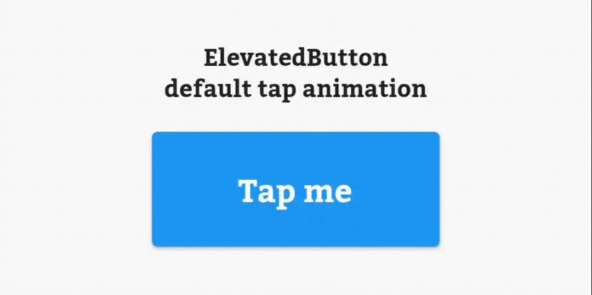

# flutter-tap-animation

This widget provides a tap animation for its child. It's compatible with other GestureDetectors.

Wrap a widget with `Tap` to give it a tap animation like this:

```dart
Tap(
  child: ElevatedButton(
    onPressed: () {},
    child: Text(
      'Tap me',
    ),
  ),
),
```



